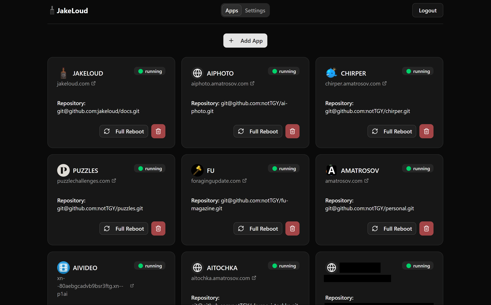

# JakeLoud (project jl)

Jakeloud is like a box of chocolates. You never know
what you're gonna get.

In essense it is a ci/cd tool with web ui.
Intended use is with docker, however arbitrary build,
run and clone commands should be supported in the
near future.

It is a poor mans Heroku, that can run on lowest end
machines.



## Installation

Debian 11 is recommended. Other debian-based distros should work as well.

[release page](https://github.com/jakeloud/jl/releases/)

Execute this on the server:
```
sudo su
```
```
wget https://github.com/jakeloud/jl/releases/download/v1.0.8/jl
chmod +x jl
./jl
```

If you are updating jakeloud, first you have to stop it with:
```
systemctl stop jakeloud
```


## Build steps

this is what you do if you want "build from source"

```
docker build --tag=jl --file=build.Dockerfile .
docker create --name jlc jl
docker cp jlc:/app/jl jl
docker rm jlc
```

## Test steps

Maybe you want to prove jl works locally before deploying
to cloud. Though, features available without public
ipv4 are very limited.

```
docker build --tag jlt --file=test.Dockerfile .
```

```
docker run --name=jakeloud-test -p 80:80 -p 443:443 -p 666:666 -d jlt
```
```
docker exec -it jakeloud-test sh
```

When inside container exec `jl` to initiate install
procedure.

### Shortcut to run build & test
```
docker build --tag=jl --file=build.Dockerfile .
docker create --name jlc jl
docker cp jlc:/app/jl jl
docker rm jlc
docker build --tag jlt --file=test.Dockerfile .
docker run --name=jakeloud-test -p 80:80 -p 443:443 -p 666:666 -d jlt
docker exec -it jakeloud-test sh
```
